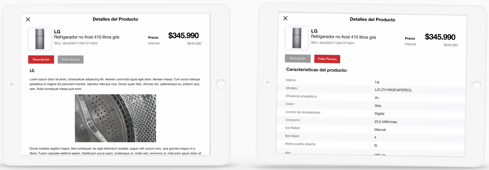

# Giuded Selling App

?>Manual de usuario version 1.1 

!>Guía práctica de uso para vendedores.

## 1 Inicio de sesión

Al momento de abrir la aplicación el usuario deberá iniciar sesión con los datos suministrados al crear su usuario y contraseña, en caso de olvidar la contraseña puede recuperarla vía email. Y posteriormente seleccionar la tienda a la cual pertenece o buscarla en la barra de búsqueda de la parte superior.

## 2 Pantalla de inicio

Luego de iniciar sesión, esta será la pantalla de inicio. Desde acá podrás hacer búsquedas y escanear productos. Tendrás acceso directo a las subcategorías de pertenecientes a tu categoría principal. También podrás hacer lo mismo con las demás categorías disponibles.

## 3 Selección de subcategorías

1. Al momento de seleccionar una de las categorías, pasara como principal y a su costado podrás ver desplegadas, todas las subcategorías que contiene. 

2. Selecciona una subcategoría para llegar a la lista de productos.

    

## 4 Búsqueda

Al ir a la sección de búsqueda se te mostrarán las categorías de producto y podrás buscar tu producto por nombre, marca, modelo o por palabra clave. También podrás escanear un producto específico.

 

## 5 Lista de productos

Al momento de ingresar en una categoría llegarás a una lista de productos, la cual podrás filtrar, comparar y ver.
También podrás navegar entre las principales acciones de la app.

 

## 6 Filtros

Con los filtros podrás hacer más exhaustiva la búsqueda del cliente y llevar a resultados más exactos para así impulsar la venta y generar una experiencia rápida y efectiva.

	
## 7 Comparar productos

Cuando seleccionas dos productos, tendrás la posibilidad de compararlos, desde el precio hasta sus características. También podrás agregar los productos al carro desde esta vista.

## 8 Sección de guided selling

Al momento de ingresar a la lista de productos de una categoría, tendrás la alternativa de usar el “Guided selling” (Venta guiada), el cual te ofrece una serie de preguntas que te ayudarán a ofrecer al cliente una lista de productos al cliente en base a sus respuestas.

 
 
Las preguntas serán simples, para filtrar entre todos los productos, el que mejor acomode al cliente y pueda impulsar la venta mediante opciones basadas en sus gustos.	
 
 

## 9 Ficha de producto

Al seleccionar un producto, se abrirá su ficha de producto, en ella se mostrarán los detalles del mismo. Podrás ver y escoger el color, ver información del producto, stock y agregar al carro.

 

## 10 Información del producto

Aquí veras descripciones del producto y la ficha técnica para ver en detalle las especificaciones que el cliente podría necesitar.

## 11 Servicios adicionales

Cuando ingreses ciertos productos al carro de compra, podrás incluir servicios como: garantía, armado, etc. Si el cliente así lo desea.

 

## 12 Carro de compra

En el carro de compra veras los productos que vas agregando junto con los servicios asociados al producto que deseas complementar, el cliente podrá pagar esos productos en caja o podrás seguir comprando mientras mantienes tus productos en el carro.

## 13 Perfil usuario

En la sección de perfil de usuario el vendedor podrá editar su información y cambiar su clave, ver sus estadísticas de venta y cerrar sesión.

 

## 14 Cotizaciones usuario

1. Podrás ver todas las cotizaciones hechas por el usuario dentro del mes, semana o días. 
2. También ver el detalle de cada cotización que tengas registrada.

