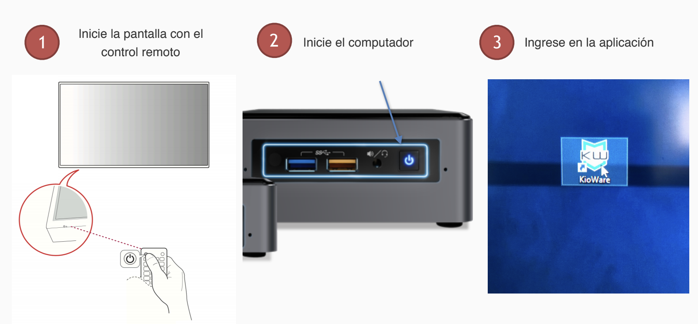
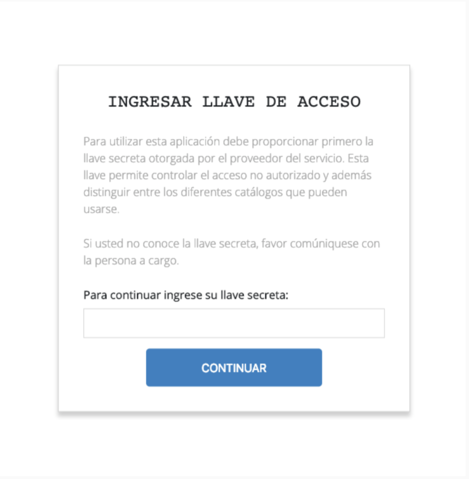
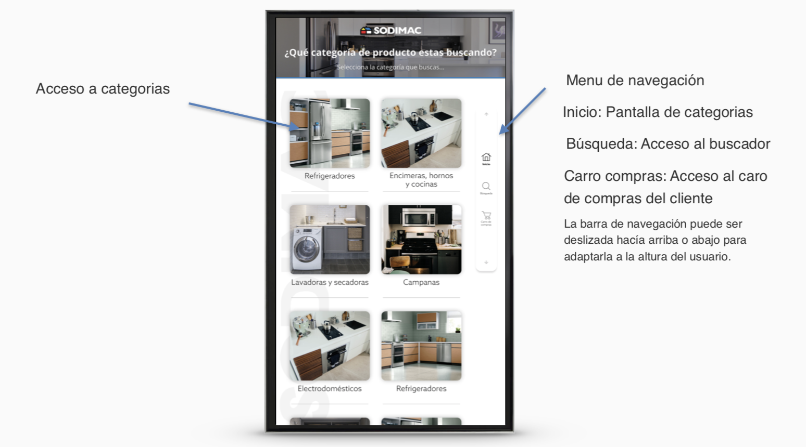
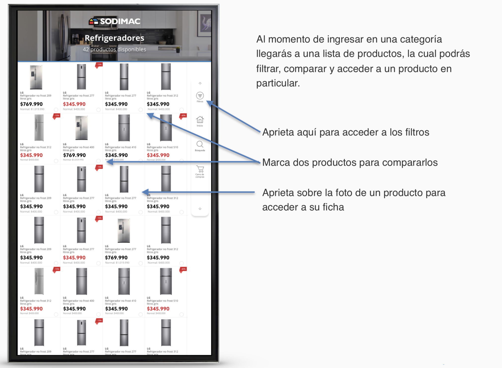
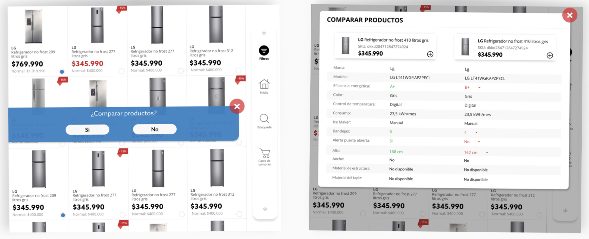
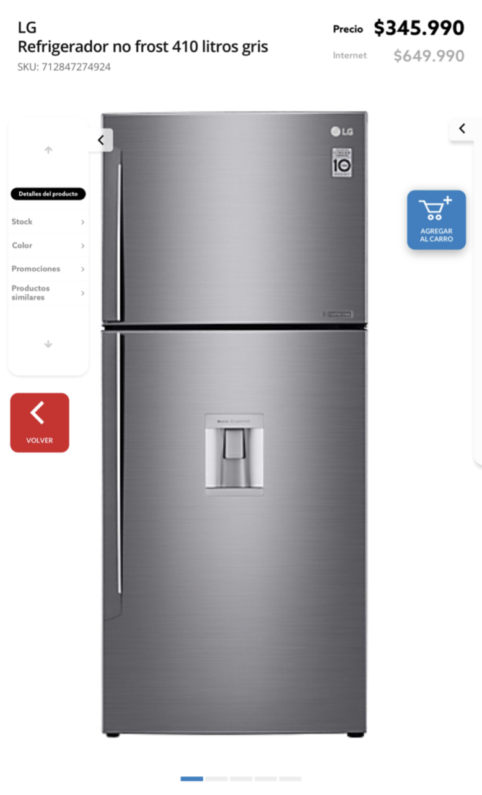
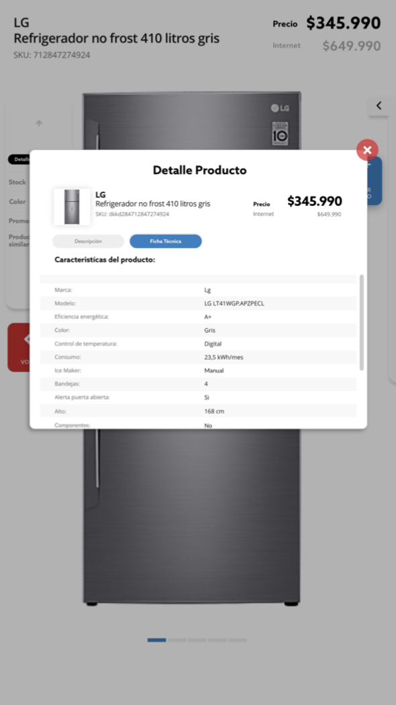
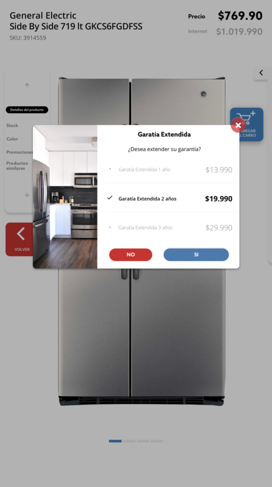
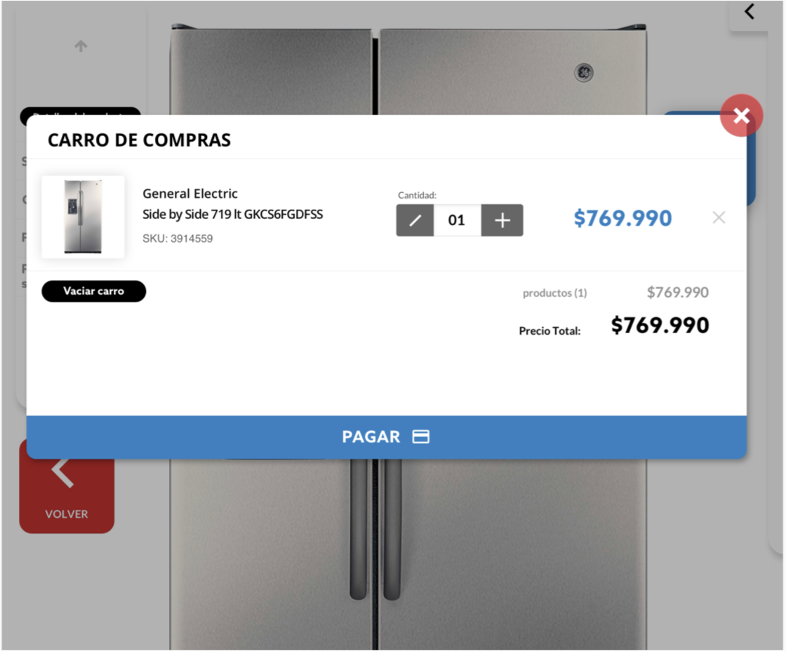
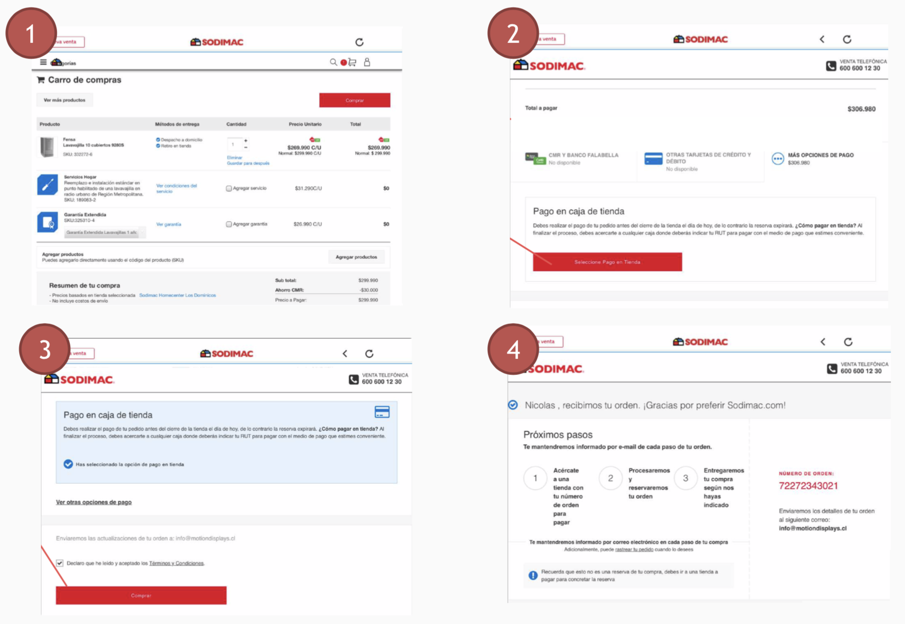

# Guided Selling Kiosco 

?>Manual de usuario version 1.1 

!>Nota: el computador debe estar conectado a la red para las etapas siguientes

## 1 Puesta en marcha

## 2 Configuración catalogo

Al momento de lanzar un kiosco, se debe ingresar las llaves de accesos correspondientes al catalogo que desea mostrar.

nota --> Indicar como recuperar las llaves

## 3 Pantalla de inicio

Desde la pantalla de inicio el usuario podrá ver y elegir alguna categoría para ver sus productos. También podrá hacer búsquedas de productos y ver su carro de compras.

## 4 Lista de productos

Al momento de ingresar en una categoría llegarás a una lista de productos, la cual podrás filtrar, comparar y acceder a un producto en particular.

## 5 Filtros

Con los filtros podrás hacer más exhaustiva la búsqueda del cliente y llevar a resultados más exactos para así impulsar la venta y generar una experiencia rápida y efectiva.

## 6 Comparar productos

 Cuando seleccionas dos productos, tendrás la posibilidad de compararlos, desde el precio hasta sus características. También podrás agregar los productos al carro desde esta vista.

## 7 Ficha de producto

Al seleccionar un producto, se abrirá su ficha de producto, en ella se mostrarán los detalles del mismo. Podrás ver y escoger el color, ver información del producto, stock y agregar al carro.

## 8 Información del producto

Aquí veras descripciones del producto y la ficha técnica para ver en detalle las especificaciones que el cliente podría necesitar.

## 9 Servicios adicionales

Cuando ingreses ciertos productos al carro de compra, podrás incluir servicios como: garantía, armado, etc. Si el cliente así lo desea.

## 10 Carro de compra

En el carro de compra veras los productos que vas agregando junto con los servicios asociados al producto que deseas complementar, el cliente podrá pagar esos productos en caja o podrás seguir comprando mientras mantienes tus productos en el carro.

## 11 Checkout

Al iniciar el proceso de pago, la aplicaciones lleva el usuario a sodimac.cl usando el mismo proceso de checkout que los modulos.com llamado “botón de pago”

